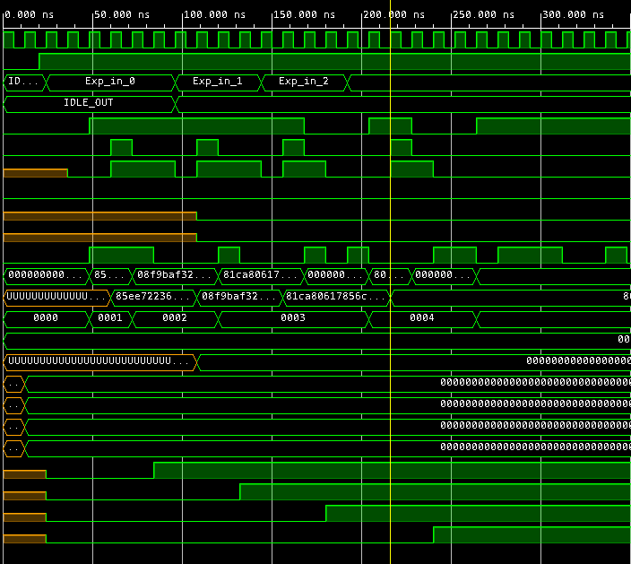
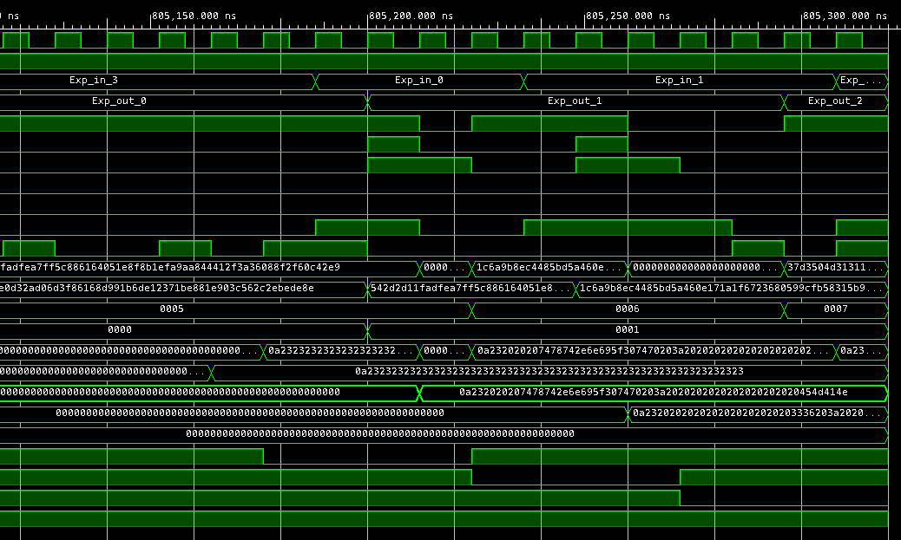

## Simulation pictures






With 4 cores the first output comes after ~800us


1. 85EE722363960779206A2B37CC8B64B5FC12A934473FA0204BBAAF714BC90C01
   1. 0A23232323232323232323232323232323232323232323232323232323232323
2. 08F9BAF32E8505CBC9A28FED4D5791DCE46508C3D1636232BF91F5D0B6632A9F
   1. 0A232020207478742E6E695F307470203A2020202020202020202020454D414E
3. 81CA80617856C964E2F92DDE82841CC7CE81210F56BF18A32D2EE2ADA64586D6
   1. 0A2320202020202020202020203336203A2020544E554F43204547415353454D
4. 805974EFD1C6E0D32AD06D3F86168D991B6DE12371BE881E903C562C2EBEDE8E
   1. 
5. 542D2D11FADFEA7FF5C886164051E8F8B1EFA9AA844412F3A36088F2F60C42E9


``` vh
Vivado Commands
General Messages
[IP_Flow 19-234] Refreshing IP repositories

[IP_Flow 19-1700] Loaded user IP repository '/home/aleksw/Documents/tfe4141_rsa_integration_kit_2020/RSA_accelerator/IP'.

[IP_Flow 19-2313] Loaded Vivado IP repository '/home/aleksw/Apps/Xilinx/Vivado/2019.2/data/ip'.

[SIM-utils-51] Simulation object is 'sim_1'

[SIM-utils-54] Inspecting design source files for 'RSA_accelerator_tb' in fileset 'sim_1'...

[SIM-utils-43] Exported '/home/aleksw/Documents/tfe4141_rsa_integration_kit_2020/RSA_accelerator/RSA_accelerator/RSA_accelerator.sim/sim_1/behav/xsim/short_test.otp_messages.hex_pt3_out.txt'

[USF-XSim-2] XSim::Compile design

[USF-XSim-3] XSim::Elaborate design

[USF-XSim-61] Executing 'COMPILE and ANALYZE' step in '/home/aleksw/Documents/tfe4141_rsa_integration_kit_2020/RSA_accelerator/RSA_accelerator/RSA_accelerator.sim/sim_1/behav/xsim'

[USF-XSim-69] 'compile' step finished in '2' seconds

[USF-XSim-4] XSim::Simulate design

[USF-XSim-98] *** Running xsim

[USF-XSim-8] Loading simulator feature

[USF-XSim-96] XSim completed. Design snapshot 'RSA_accelerator_tb_behav' loaded.

[USF-XSim-97] XSim simulation ran for 1000ns

[Wavedata 42-471] Note: Nothing was found for the following items: core/rl_exp/curr_state_exp core/rl_exp/curr_state_mp 

[Vivado 12-5682] Launching behavioral simulation in '/home/aleksw/Documents/tfe4141_rsa_integration_kit_2020/RSA_accelerator/RSA_accelerator/RSA_accelerator.sim/sim_1/behav/xsim'

[SIM-utils-51] Simulation object is 'sim_1'

[SIM-utils-54] Inspecting design source files for 'RSA_accelerator_tb' in fileset 'sim_1'...

[USF-XSim-97] Finding global include files...

[USF-XSim-98] Fetching design files from 'sim_1'...

[USF-XSim-2] XSim::Compile design

[Vivado 12-5682] Launching behavioral simulation in '/home/aleksw/Documents/tfe4141_rsa_integration_kit_2020/RSA_accelerator/RSA_accelerator/RSA_accelerator.sim/sim_1/behav/xsim'

[USF-XSim-3] XSim::Elaborate design

[Simtcl 6-17] Simulation restarted

Synthesis
[IP_Flow 19-234] Refreshing IP repositories

[IP_Flow 19-1700] Loaded user IP repository '/home/aleksw/Documents/tfe4141_rsa_integration_kit_2020/RSA_accelerator/IP'.

[IP_Flow 19-2313] Loaded Vivado IP repository '/home/aleksw/Apps/Xilinx/Vivado/2019.2/data/ip'.

[Common 17-349] Got license for feature 'Synthesis' and/or device 'xc7z020'

[Device 21-403] Loading part xc7z020clg400-1

[Synth 8-638] synthesizing module 'rsa_accelerator' ["/home/aleksw/Documents/tfe4141_rsa_integration_kit_2020/RSA_accelerator/source/rsa_accelerator.vhd":84]

[Synth 8-6014] Unused sequential element slv_reg_reg[33] was removed.  ["/home/aleksw/Documents/tfe4141_rsa_integration_kit_2020/RSA_accelerator/source/rsa_regio.vhd":246]

[Synth 8-256] done synthesizing module 'rsa_regio' (1#1572) ["/home/aleksw/Documents/tfe4141_rsa_integration_kit_2020/RSA_accelerator/source/rsa_regio.vhd":116]

[Synth 8-3491] module 'CompressorMultiBit_4to2' declared at '/home/aleksw/Documents/tfe4141_rsa_integration_kit_2020/Exponentiation/source/CompressorMultiBit_4to2.vhd:5' bound to instance 'Cprs_Inst' of component 'CompressorMultiBit_4to2' ["/home/aleksw/Documents/tfe4141_rsa_integration_kit_2020/Exponentiation/source/MonPro.vhd":94]

[Common 17-14] Message 'Synth 8-3491' appears 100 times and further instances of the messages will be disabled. Use the Tcl command set_msg_config to change the current settings.

[Synth 8-226] default block is never used ["/home/aleksw/Documents/tfe4141_rsa_integration_kit_2020/Exponentiation/source/MonPro.vhd":182]

[Synth 8-614] signal 'last_input_msg_exp0' is read in the process but is not in the sensitivity list ["/home/aleksw/Documents/tfe4141_rsa_integration_kit_2020/RSA_accelerator/source/rsa_core.vhd":240]

[Synth 8-3331] design rsa_msgin has unconnected port S_AXIS_TSTRB[3]

[Synth 8-802] inferred FSM for state register 'curr_state_exp_reg' in module 'exponentiation'

[Synth 8-3354] encoded FSM with state register 'curr_state_exp_reg' using encoding 'one-hot' in module 'exponentiation'

[Synth 8-327] inferring latch for variable 'next_msgin_exp_reg' ["/home/aleksw/Documents/tfe4141_rsa_integration_kit_2020/RSA_accelerator/source/rsa_core.vhd":149]

[Synth 8-3333] propagating constant 0 across sequential element (exponentiation:/\message_reg_reg[256] )

[Synth 8-3886] merging instance 'i_0/u_rsa_regio/axi_rresp_reg[0]' (FDRE) to 'i_0/u_rsa_regio/axi_rresp_reg[1]'

[Project 1-571] Translating synthesized netlist

[Netlist 29-17] Analyzing 199 Unisim elements for replacement

[Netlist 29-28] Unisim Transformation completed in 0 CPU seconds

[Project 1-570] Preparing netlist for logic optimization

[Opt 31-138] Pushed 0 inverter(s) to 0 load pin(s).

[Project 1-111] Unisim Transformation Summary:
No Unisim elements were transformed.

```

